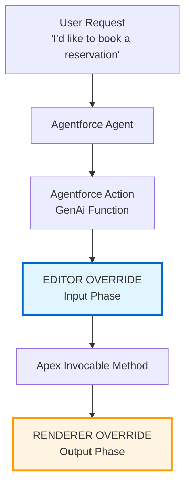

# Lightning Type Overrides for Agentforce Actions - Demo

This repository demonstrates how to implement **Lightning Type Overrides (LTO)** for Agentforce Actions, allowing you to customize how data types are rendered and edited in the Agent Builder interface.

**Included Demo:**

1. **Reservation** - Editor + Renderer overrides (custom form input and styled confirmation card)

## Documentation

- [Lightning Types - Get Started](https://developer.salesforce.com/docs/ai/agentforce/guide/lightning-types-get-started.html)
- [Lightning Types - Full Editor and Renderer Example](https://developer.salesforce.com/docs/ai/agentforce/guide/lightning-types-example-full-editor-renderer.html)

## What Are Lightning Type Overrides?

Lightning Type Overrides replace both the default UI components AND conversational interactions that Agentforce uses to collect and display data. Instead of the agent asking multiple questions ("What date?", "What time?", "How many people?"), you provide a single custom form. Similarly, instead of displaying data generically, you can create styled, branded cards.

- **Editor Override**: Replaces conversational data collection with a custom UI form
- **Renderer Override**: Customizes how data is displayed to the user

## Architecture



## Reservation Demo (Editor + Renderer)

Shows both an **Editor Override** (custom form for input) and a **Renderer Override** (styled confirmation card).

| Component     | File                                                                                                              | Purpose                                                   |
| ------------- | ----------------------------------------------------------------------------------------------------------------- | --------------------------------------------------------- |
| Apex Action   | [`BookReservationAction.cls`](force-app/main/default/classes/BookReservationAction.cls)  | Accepts `ReservationRequest`, returns `ReservationDTO`    |
| Editor LWC    | [`reservationForm`](force-app/main/default/lwc/reservationForm/)                         | Custom form (target: `lightning__AgentforceInput`)        |
| Editor Type   | [`ReservationEditor`](force-app/main/default/lightningTypes/ReservationEditor/)          | Maps to `Reservation$ReservationRequest`                  |
| Renderer LWC  | [`reservationCard`](force-app/main/default/lwc/reservationCard/)                         | Confirmation card (target: `lightning__AgentforceOutput`) |
| Renderer Type | [`ReservationRenderer`](force-app/main/default/lightningTypes/ReservationRenderer/)      | Maps to `Reservation$ReservationDTO`                      |


## Getting Started

### Prerequisites

- [Salesforce CLI](https://developer.salesforce.com/tools/salesforcecli)
- An [Agentforce Developer Edition org](https://www.salesforce.com/products/free-trial/developer/)
- A service agent with an Enhanced Chat v2 deployment or an employee agent

### 1. Clone and Deploy

```bash
# Clone the project
git clone https://github.com/charlesw-salesforce/lightning-type-override-demo.git
cd lightning-types-demo

# Auth into Developer Edition org
sf org login web --alias agentforce-demo

# Deploy the project
sf project deploy start --target-org agentforce-demo
```

### 2. Assign Permission Set to Agent User

Assign [`Agent Apex Action Access`](force-app/main/default/shared/permissionsets/Agent_Apex_Action_Access.permissionset-meta.xml) to your Agent's **EinsteinServiceAgent** user:

1. **Setup** > **Permission Sets** > **Agent Apex Action Access**
2. **Manage Assignments** > **Add Assignment**
3. Select the **EinsteinServiceAgent** user > **Assign**

### 3. Configure Your Agent

1. **Setup** > **Agents** > Select your agent > **Open in Agent Builder**
2. Create a new **Topic** for your use case
3. Add the `Book_Reservation` action to your topic
4. Save and activate

### 4. Test

Test the agent with: "I'd like to book a reservation"

You should see the custom Editor UI followed by a styled Confirmation card.

## License

This project is released under the [Apache License 2.0](LICENSE.md).
