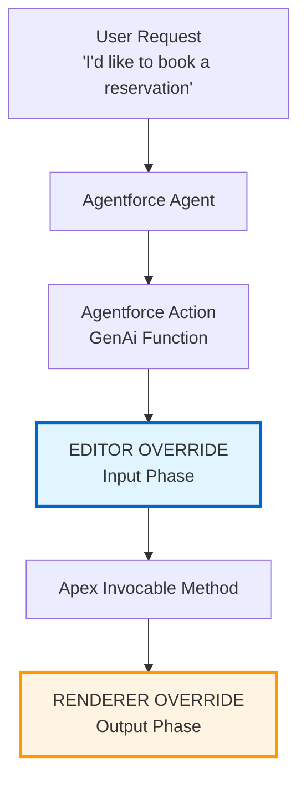

# Lightning Type Overrides for Agentforce Actions - Demo

This repository demonstrates how to implement **Lightning Type Overrides (LTO)** for Agentforce Actions, allowing you to customize how data types are rendered and edited in the Agent Builder interface.

**Included Demos:**

1. **Reservation** - Editor + Renderer overrides (custom form input and styled confirmation card)
2. **Storefront** - Renderer-only override with list/collection support (carousel display)

## Documentation

- [Lightning Types - Get Started](https://developer.salesforce.com/docs/ai/agentforce/guide/lightning-types-get-started.html)
- [Lightning Types - Full Editor and Renderer Example](https://developer.salesforce.com/docs/ai/agentforce/guide/lightning-types-example-full-editor-renderer.html)

## What Are Lightning Type Overrides?

Lightning Type Overrides replace both the default UI components AND conversational interactions that Agentforce uses to collect and display data. Instead of the agent asking multiple questions ("What date?", "What time?", "How many people?"), you provide a single custom form. Similarly, instead of displaying data generically, you can create styled, branded cards.

- **Editor Override**: Replaces conversational data collection with a custom UI form
- **Renderer Override**: Customizes how data is displayed to the user

## Architecture



## Demo 1: Reservation (Editor + Renderer)

Shows both an **Editor Override** (custom form for input) and a **Renderer Override** (styled confirmation card).

| Component     | File                                                                                                              | Purpose                                                   |
| ------------- | ----------------------------------------------------------------------------------------------------------------- | --------------------------------------------------------- |
| Apex Action   | [`BookReservationAction.cls`](force-app/main/default/02_editorAndRenderer/classes/BookReservationAction.cls)  | Accepts `ReservationRequest`, returns `ReservationDTO`    |
| Editor LWC    | [`reservationView`](force-app/main/default/02_editorAndRenderer/lwc/reservationView/)                         | Custom form (target: `lightning__AgentforceInput`)        |
| Editor Type   | [`ReservationRequest`](force-app/main/default/02_editorAndRenderer/lightningTypes/ReservationRequest/)        | Maps to `Reservation$ReservationRequest`                  |
| Renderer LWC  | [`reservationConfirmation`](force-app/main/default/02_editorAndRenderer/lwc/reservationConfirmation/)         | Confirmation card (target: `lightning__AgentforceOutput`) |
| Renderer Type | [`ReservationConfirmation`](force-app/main/default/02_editorAndRenderer/lightningTypes/ReservationConfirmation/) | Maps to `Reservation$ReservationDTO`                   |

---

## Demo 2: Storefront (Renderer with Collection Support)

Shows a **Renderer-only Override** that handles **lists/collections** of items in a carousel.

| Component      | File                                                                                                            | Purpose                                                              |
| -------------- | --------------------------------------------------------------------------------------------------------------- | -------------------------------------------------------------------- |
| Apex Action    | [`AgentStorefrontActions.cls`](force-app/main/default/01_rendererOnly/classes/AgentStorefrontActions.cls) | Queries `Storefront__c` by name, returns list of `StorefrontSummary` |
| GenAi Function | [`Get_Storefronts_By_Name`](force-app/main/default/01_rendererOnly/genAiFunctions/Get_Storefronts_By_Name/) | Links to Apex invocable                                            |
| Renderer LWC   | [`storefrontDisplay`](force-app/main/default/01_rendererOnly/lwc/storefrontDisplay/)                      | Carousel with prev/next navigation                                   |
| Renderer Type  | [`Storefront`](force-app/main/default/01_rendererOnly/lightningTypes/Storefront/)                         | Includes `collection` block for array rendering                      |
| Custom Object  | [`Storefront__c`](force-app/main/default/01_rendererOnly/objects/Storefront__c/)                          | Storefront data                                                      |

**Key difference:** The [`renderer.json`](force-app/main/default/01_rendererOnly/lightningTypes/Storefront/lightningDesktopGenAi/renderer.json) includes a `collection` block to handle arrays:

```json
{
  "renderer": {
    "componentOverrides": { "$": { "definition": "c/storefrontDisplay" } }
  },
  "collection": {
    "renderer": {
      "componentOverrides": { "$": { "definition": "c/storefrontDisplay" } }
    }
  }
}
```

---

## Getting Started

### Prerequisites

- [Salesforce CLI](https://developer.salesforce.com/tools/salesforcecli)
- An [Agentforce Developer Edition org](https://www.salesforce.com/products/free-trial/developer/)
- A service agent with an Enhanced Chat v2 deployment or an employee agent

### 1. Clone and Deploy

```bash
git clone https://github.com/charlesw-salesforce/lightning-type-override-demo.git
cd lightning-types-demo
sf org login web --alias agentforce-demo
sf project deploy start --target-org agentforce-demo
```

### 2. Assign Permission Set

Assign [`Agent Apex Action Access`](force-app/main/default/shared/permissionsets/Agent_Apex_Action_Access.permissionset-meta.xml) to your Agent's **EinsteinServiceAgent** user:

1. **Setup** > **Permission Sets** > **Reservation Apex Action Access**
2. **Manage Assignments** > **Add Assignment**
3. Select the **EinsteinServiceAgent** user > **Assign**

### 3. Configure Your Agent

1. **Setup** > **Agents** > Select your agent > **Open in Agent Builder**
2. Create a new **Topic** for your use case
3. Add the relevant **Actions** to your topic:
   - `Book_Reservation` - For the reservation demo
   - `Get_Storefronts_By_Name` - For the storefront demo
4. Save and activate

### 4. Test

**Reservation Demo:** "I'd like to book a reservation"

- You should see the custom Editor UI followed by a styled Confirmation card.

**Storefront Demo:** "Find storefronts named [search term]"

- You should see a carousel of matching storefront cards.

## License

This project is released under the [CC0 1.0 Universal](LICENSE.md) license.
